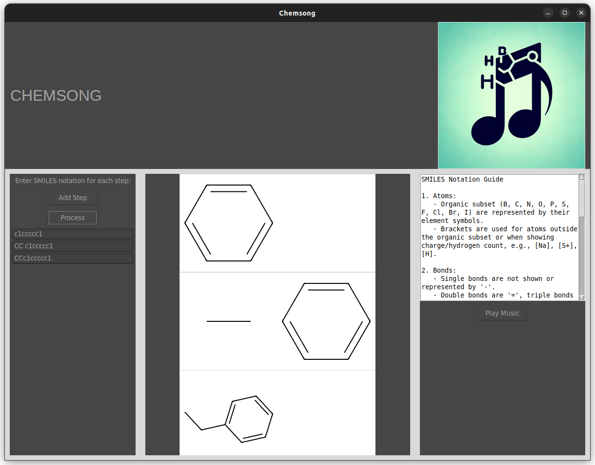
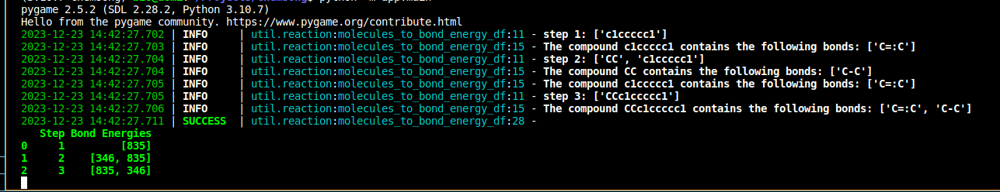

# Chemsong V0.1

## Overview

Map the energies of chemical bonds to musical scales.

## Features

- **Interactive Interface**: exists.
- **Chemical Reaction Visualization**: Utilizes RDKit for  rendering molecular structures based on user input.
- **Audio Mapping of Bond Energies**: Converts chemical bond energies into musical notes for an auditory representation of reactions.

## Upcoming Features

### V0.2
- **Genetic processing** Chemsong becomes Genesong, parse ACTG and map the sequence onto notes. Likely 2 nucleotide snippets will be used for more complete octave coverage.
- **Scale selection** Ability to select what scale is played (currently Am) from a dropdown menu
- **Random chemical reactions** Ability to generate a random chemical reaction if you don't want to have to type something out

### V1.0
- **Object-Oriented Approach**: Future updates will introduce object-oriented programming (OOP) to manage each reaction step, incorporating methods for playing audio, verifying SMILES notation, and rendering images efficiently.
- **Advanced Audio Capabilities**: Enhancement of the audio system to provide more sophisticated and meaningful auditory representations of chemical reactions.*

### V2.0
- **Reverse workflow** turn midi-input key notes into molecular reactions.

## Project Structure

- `app/`: Contains the main scripts to run Chemsong.
- `util/`: Includes essential subsystems and utilities for Chemsong.
= `test/`: Unit testing for some basic dataframe parsing
- `RnD/`: Research and development scripts, including preliminary tests and experiments.

## Getting Started

To start using Chemsong, ensure you have Python (version 3.7 or later) installed, along with RDKit, Pandas, and other required libraries as listed in `requirements.txt`. Try firing up a virtual env and running:

`pip install -r requirements.txt`

## Example cmd output:
The bond energies are transcribed from source: Data from J. E. Huheey, E. A. Keiter, and R. L. Keiter, Inorganic Chemistry, 4th ed. (1993)

Bond energy values are output using loguru in the command line, example:

## Testing:
To run the existing (unit) tests, make sure pytest is installed then run:

`python -m pytest test`

## Current known errors:
- Program recognizes triple bonds in cyclic carbons, which is bananas.
- Chemical images keep getting added, they should be removed before every 'process'
- Can't see all images, need a scroll bar
- third item to satisfy rule of threes

## Contributing

Contributions are highly encouraged, whether it's through enhancing audio mappings, improving visualizations, or introducing new features.

### Thanks to the following contributors for helping in early dev:
- Matt Fries: [moonpapasart.com](moonpapasart.com)

## License

This project is open-sourced under the MIT License.
